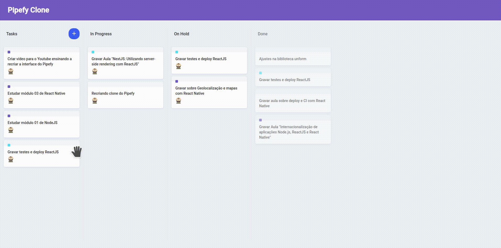

# UI Clones
<!-- You can add logo to your application here. Use https://www.canva.com/pt_br/criar/logotipo/ to create logos.
 -->

## Overview
*A repository of UI clones from different popular websites. The main purpose of this repo is to learn new css techniques and also how popular websites build their ui. Most of the inside projects are ui only with some logic.*


## 🚀 Getting Started

### 🚨 Prerequisites

#### MacOS
Install Homebrew

```
/bin/bash -c "$(curl -fsSL https://raw.githubusercontent.com/Homebrew/install/master/install.sh)"
```
Install tools

```
brew install yarn
brew install node
```

#### Ubuntu
Configuring repository

```
curl -sS https://dl.yarnpkg.com/debian/pubkey.gpg | sudo apt-key add -
echo "deb https://dl.yarnpkg.com/debian/ stable main" | sudo tee /etc/apt/sources.list.d/yarn.list
```
Install tools

```
sudo apt update
sudo apt install yarn
sudo apt install nodejs
```

#### Windows
Install [Chocolatey](https://chocolatey.org/install)

Install tools
```
choco install yarn
choco install nodejs
```


### 📥 Installing dependencies

Inside the project folder you want, run:

```
yarn
```

### 🏎 Running application
Inside the project folder you want, run the following command to start the web application
```
yarn start
```

## 📷 Screenshots
- Pipefy Clone
<p align="center">
    
    <!--  -->
</p>

## 🛠 Built With

* [Node](https://nodejs.org/)
* [ReactJs](https://reactjs.org/)
* [Yarn](https://yarnpkg.com/)

## 🎖 Author
* **Geraldo Braz** - *Initial work* - [@geraldobraz](https://github.com/geraldobraz)
